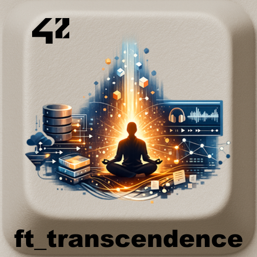
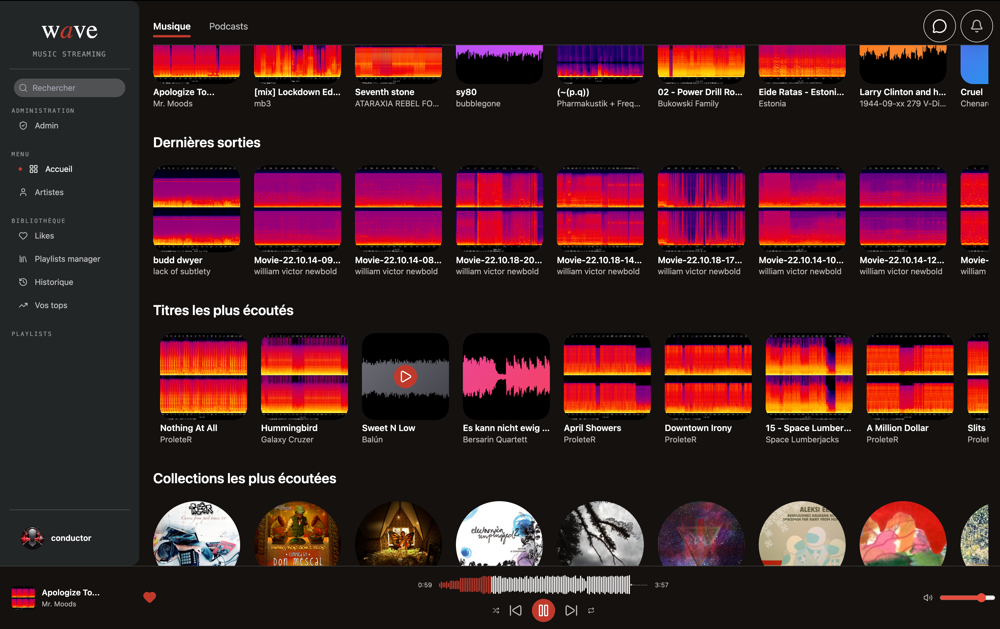
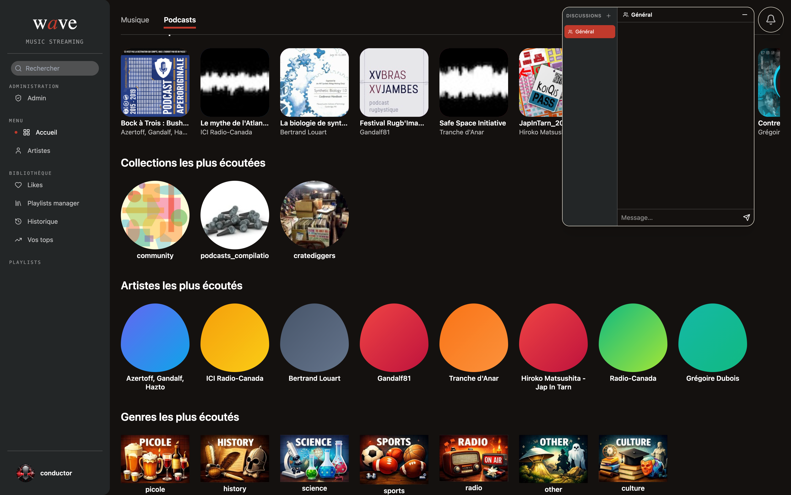
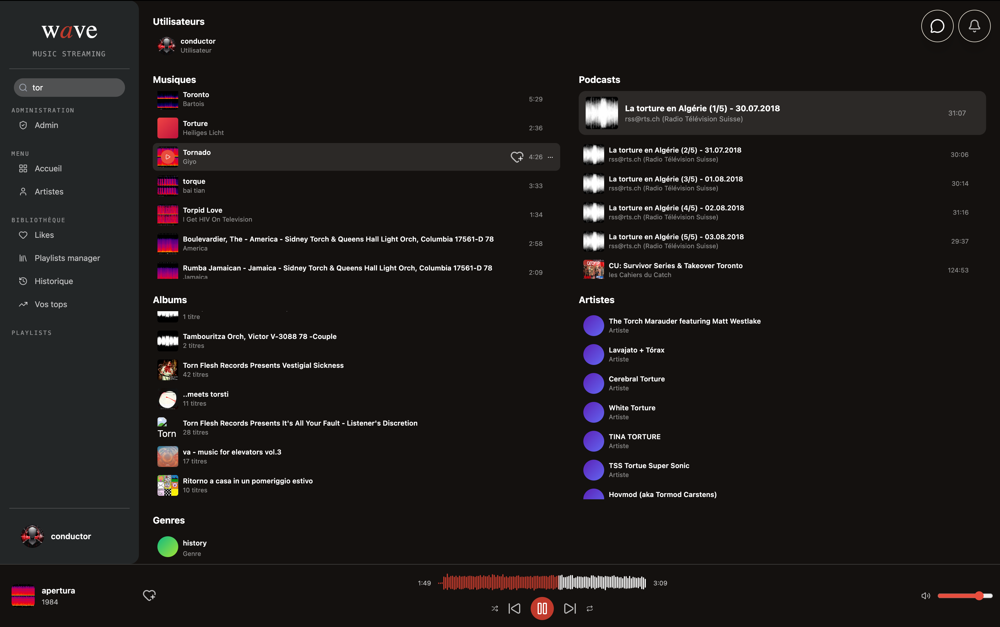

<div align="center">
  <h1>ft_transcendence - Wave</h1>
  
  <br>
</div>


> **Wave** is a music streaming platform built as part of the **ft_transcendence** project at 42 School.

---

## Table of Contents

- [Description](#description)
- [Data Sources](#data-sources)
- [Features](#features)
- [Screenshots](#screenshots)
- [Technical Stack](#technical-stack)
- [Quick Start](#quick-start)
- [Installation](#installation)
- [Usage](#usage)
- [Project Structure](#project-structure)
- [Documentation](#documentation)
- [Team](#team)
- [License](#license)

---

## Description

Wave follows the spirit of `ft_transcendence` by building a full web application around a custom module: music streaming.

The project combines:

- audio playback and a music / podcast catalogue;
- user accounts, JWT authentication and Google OAuth;
- profiles, avatars, roles and permissions;
- friends, public chat and real-time private messaging;
- WebSocket notifications;
- likes, playlists, listening history and analytics;
- fast search powered by Meilisearch;
- a PostgreSQL database populated through migrations.

---

## Data Sources

The audio catalogue seeded into the database was built from open data sources:

- [Internet Archive](https://archive.org/) : main source for audio files, covers, original source pages and music / podcast content.
- [MusicBrainz](https://musicbrainz.org/) : metadata enrichment, especially artists, titles, collections and classification.
- [Creative Commons](https://creativecommons.org/licenses/) : reference used to identify and understand open licenses associated with the content when available.

The migrations preserve useful attribution fields at track level (`source_url`, `license_code`, `attribution_text`). External content remains subject to its original license; the repository's MIT license only applies to the project code.

The sourcing and ETL pipeline used to collect, clean, enrich and transform this catalogue was written in **Python** before being exported into SQL migrations for PostgreSQL.

---

## Features

- Email / password authentication.
- Google OAuth 2.0 login.
- Audio player with progress bar, volume, shuffle and loop controls.
- Catalogue of tracks, artists, collections, genres, music and podcasts.
- Typo-tolerant search with Meilisearch.
- Public and private playlists.
- Likes and listening history.
- Recommendations and listening analytics.
- Friend system with requests, acceptance, rejection and blocking.
- Global chat and private messages between friends through WebSockets.
- Real-time notifications.
- Admin interface for users and tracks.

---

## Screenshots

### Music Home



### Podcast Home



### Search



---

## Technical Stack

| Layer | Technologies |
| --- | --- |
| Frontend | React, Vite, Zustand, Tailwind CSS, Wavesurfer.js |
| Backend | Go, Gin, GORM, Gorilla WebSocket |
| Database | PostgreSQL 16 |
| Cache / real-time support | Redis |
| Search | Meilisearch |
| Data sourcing / ETL | Python |
| Reverse proxy | Caddy |
| DevOps | Docker, Docker Compose, Makefile |

---

## Quick Start

The repository is runnable from GitHub. Runtime secrets are not committed, so a local `.env` file must be created from the provided example:

```bash
git clone git@github.com:LogUmi/ft_transcendence.git
cd ft_transcendence
cp .env.example .env
make dev
```

The default placeholder values in `.env.example` are enough to start the local Docker stack and use the standard email / password authentication flow. For a real deployment, replace every `change_me` value with strong secrets.

Google OAuth is optional for local testing. To enable Google login, create OAuth credentials in Google Cloud Console and set:

```env
GOOGLE_CLIENT_ID=your_real_google_client_id
GOOGLE_CLIENT_SECRET=your_real_google_client_secret
FRONTEND_URL=https://localhost:8443
```

The redirect URI configured in Google Cloud Console must match:

```text
https://localhost:8443/api/auth/google/callback
```

---

## Installation

### Requirements

- Docker with Docker Compose v2
- Make

### Configuration

Create a `.env` file at the repository root:

```bash
cp .env.example .env
```

Minimal environment:

```env
DB_HOST=postgres
DB_PORT=5432
DB_USER=trans
DB_PASSWORD=change_me
DB_NAME=transcendence

REDIS_ADDR=redis:6379
JWT_SECRET=change_me
PORT=8080

MEIL_ADDR=http://meilisearch:7700
MEILI_MASTER=change_me

GOOGLE_CLIENT_ID=your_google_client_id
GOOGLE_CLIENT_SECRET=your_google_client_secret
FRONTEND_URL=https://localhost:8443
```

Sensitive values must remain local and should not be committed.

### Run

```bash
make dev
```

The `migrate` service applies SQL migrations before the backend starts.

The application is then available at:

- HTTPS : `https://localhost:8443`
- HTTP : `http://localhost:8080` redirects to HTTPS through Caddy
- Meilisearch : `http://localhost:7700`
- Local PostgreSQL : `localhost:5432`

On macOS, the following script can help trust the local certificate:

```bash
./trust_certificate_mac.sh
```

---

## Usage

Main commands:

```bash
make up        # start the stack in the background
make dev       # apply migrations, then start the stack
make migrate   # run migrations only
make down      # stop containers
make fclean    # remove containers, volumes and stack images
make rebuild   # rebuild without cache, then restart
```

A demo account is created by the migrations:

```text
email: conductor@gmail.com
password: pass
```

---

## Project Structure

```text
.
|-- backend/             # Go / Gin API, GORM models, handlers, WebSockets
|   |-- cmd/server/      # backend entry point
|   |-- internal/        # application logic
|   `-- migrations/      # PostgreSQL schema and catalogue seed
|-- frontend/            # React / Vite application
|   |-- public/          # static assets
|   `-- src/             # pages, stores, services and UI components
|-- README_DB/           # database diagrams
|-- README_DB.md         # detailed database schema documentation
|-- README42.md          # full 42 project documentation
|-- docker-compose.yml   # service orchestration
|-- Makefile             # development commands
`-- LICENSE              # MIT license
```

---

## Documentation

- [README42.md](README42.md) : complete project description, 42 modules, roles and contributions.
- [README_DB.md](README_DB.md) : PostgreSQL schema, views, migrations and data seed.

---

## Team

Project developed by:

- **Quentin** (`Sul-iac`) - Tech Lead
- **Bastien** (`Bastien-32`) - Product Owner / Frontend
- **Loïc** (`LogUmi`) - Project Manager / Database / Backend
- **Léon** (`Zoldinn`) - WebSockets / Chat / Friends
- **Thomas** (`3scrobar`) - API Integration / Frontend / Search

Built at 42 School.

---

## License

This project is released under the MIT License. See [LICENSE](LICENSE).

> Note for 42 students: this repository is shared as an educational reference. Avoid direct copy-paste; understanding and rebuilding your own solution is still the best way to validate the project and improve.
