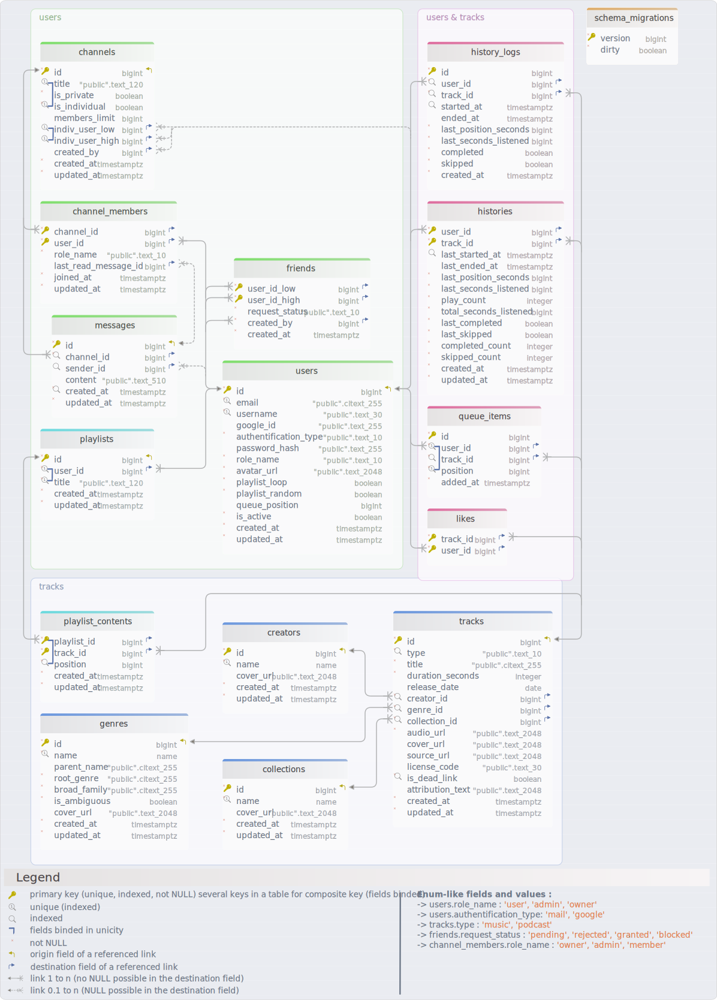
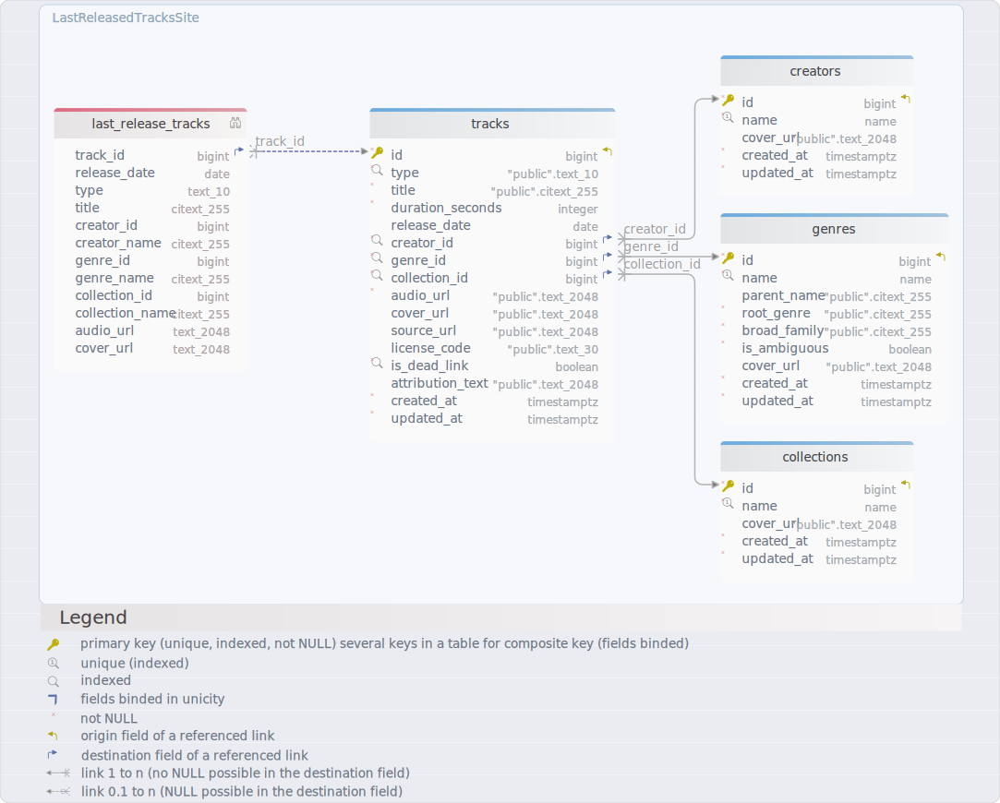
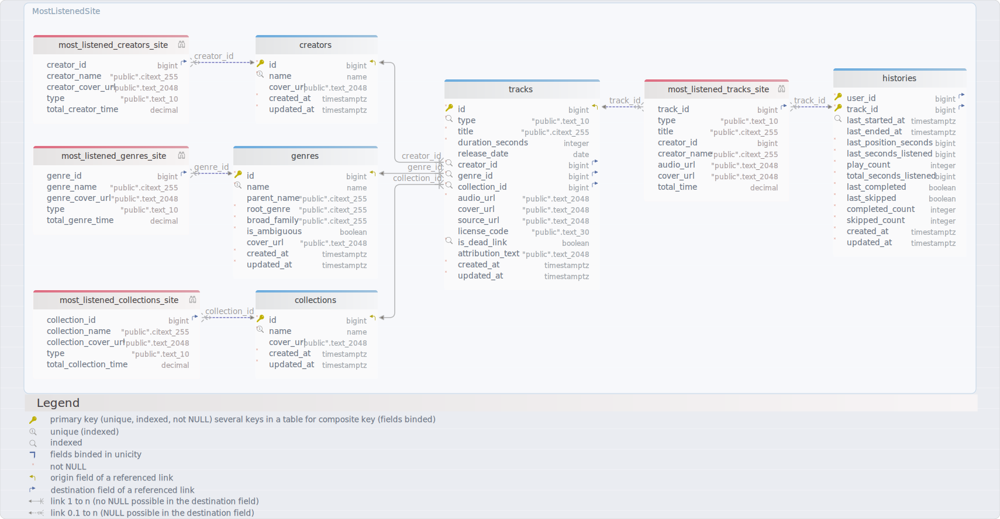
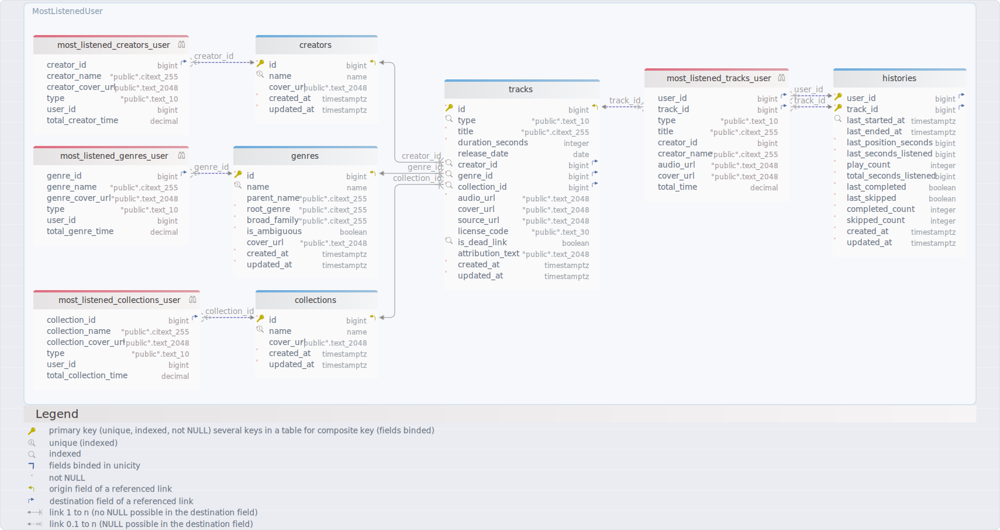

# Transcendence_Db_Diagram
Generated using [DbSchema](https://dbschema.com)

## Data seed

The database is not initialized empty: several migrations insert the data needed
to start and demonstrate the application.

| Migration | Purpose |
|---|---|
| `0002_minimal_data_seed` | Creates fallback `unknown` rows for `creators`, `genres` and `collections`, the public `general` channel, the trigger that adds every new user to this channel, and the `conductor` owner account. Demo credentials: `conductor@gmail.com` / `pass`. |
| `0003_genres_data_seed` | Loads the genre taxonomy derived from MusicBrainz, including `parent_name`, `root_genre`, `broad_family` and `is_ambiguous`. It also includes 18 podcast genres generated and selected during the sourcing phase. |
| `0004` to `0019` | Loads the music catalog sourced from Internet Archive, split into batches of 2,000 tracks, up to 24,683 music tracks. |
| `0008` to `0010`, then `0020` and `0021` | Loads the podcast episodes, up to 9,059 episodes. |
| `0022_seed_history_tables` | Adds demo listening history for the `conductor` user, so statistical views and recommendations have data during development. |

The seed is applied automatically through the Docker migrations:

```sh
make migrate
```

In the local environment, `make dev` also runs the `migrate` service before the
backend. To replay the full seed from a clean database, remove the Postgres
volume and run the migrations again, for example with `make fclean` followed by
`make dev`.

## Layouts

1. [Main Diagram](#main-diagram)
2. [Views_LastReleasedTracksSite_Diagram](#views_lastreleasedtrackssite_diagram)
3. [Views_LMostListenedSite_Diagram](#views_lmostlistenedsite_diagram)
4. [Views_MostListenedUser_Diagram](#views_mostlisteneduser_diagram)

## Tables

1. [public.channel_members](#table-publicchannel_members)
2. [public.channels](#table-publicchannels)
3. [public.collections](#table-publiccollections)
4. [public.creators](#table-publiccreators)
5. [public.friends](#table-publicfriends)
6. [public.genres](#table-publicgenres)
7. [public.histories](#table-publichistories)
8. [public.history_logs](#table-publichistory_logs)
9. [public.likes](#table-publiclikes)
10. [public.messages](#table-publicmessages)
11. [public.playlist_contents](#table-publicplaylist_contents)
12. [public.playlists](#table-publicplaylists)
13. [public.queue_items](#table-publicqueue_items)
14. [public.schema_migrations](#table-publicschema_migrations)
15. [public.tracks](#table-publictracks)
16. [public.users](#table-publicusers)

## Views

1. [public.last_release_tracks](#view-last_release_tracks)
2. [public.most_listened_collections_site](#view-most_listened_collections_site)
3. [public.most_listened_collections_user](#view-most_listened_collections_user)
4. [public.most_listened_creators_site](#view-most_listened_creators_site)
5. [public.most_listened_creators_user](#view-most_listened_creators_user)
6. [public.most_listened_genres_site](#view-most_listened_genres_site)
7. [public.most_listened_genres_user](#view-most_listened_genres_user)
8. [public.most_listened_tracks_site](#view-most_listened_tracks_site)
9. [public.most_listened_tracks_user](#view-most_listened_tracks_user)


### Main Diagram
[Index](#layouts) [Next](#views_lastreleasedtrackssite_diagram)



### Table public.channel_members 
|Idx |Name |Data Type |
|---|---|---|
| * &#128273;  &#11016; | channel\_id| bigint  |
| * &#128273;  &#11016; | user\_id| bigint  |
| * | role\_name| "public".text\_10  DEFAULT 'member'::text |
| &#11016; | last\_read\_message\_id| bigint  |
| * | joined\_at| timestamptz  DEFAULT now() |
| * | updated\_at| timestamptz  DEFAULT now() |


##### Indexes 
|Type |Name |On |
|---|---|---|
| &#128273;  | channel\_members\_pk | ON channel\_id, user\_id|
| &#128270;  | channel\_members\_user\_idx | ON user\_id|

##### Foreign Keys
|Type |Name |On |
|---|---|---|
|  | channel_members_channel_id_fkey | ( channel\_id ) ref [public.channels](#table-publicchannels) (id) |
|  | channel_members_user_id_fkey | ( user\_id ) ref [public.users](#table-publicusers) (id) |
|  | channel_members_last_read_message_id_fkey | ( last\_read\_message\_id ) ref [public.messages](#table-publicmessages) (id) |


##### Constraints
|Name |Definition |
|---|---|
| channel_members_role_name_check | role\_name)::text = ANY (ARRAY['owner'::text, 'admin'::text, 'member'::text] |


### Table public.channels 
|Idx |Name |Data Type |
|---|---|---|
| * &#128273;  &#11019; | id| bigint GENERATED  ALWAYS AS IDENTITY |
| &#128269; | title| "public".text\_120  |
| * | is\_private| boolean  DEFAULT true |
| * &#128269; | is\_individual| boolean  DEFAULT false |
|  | members\_limit| bigint  |
| &#128269; &#11016; | indiv\_user\_low| bigint  |
| &#128269; &#11016; | indiv\_user\_high| bigint  |
| &#11016; | created\_by| bigint  |
| * | created\_at| timestamptz  DEFAULT now() |
| * | updated\_at| timestamptz  DEFAULT now() |


##### Indexes 
|Type |Name |On |
|---|---|---|
| &#128273;  | channels\_pkey | ON id|
| &#128269;  | channels\_title\_is\_individual\_idx | ON title, is\_individual|
| &#128269;  | channels\_indiv\_unique\_idx | ON indiv\_user\_low, indiv\_user\_high|

##### Foreign Keys
|Type |Name |On |
|---|---|---|
|  | channels_indiv_user_low_fkey | ( indiv\_user\_low ) ref [public.users](#table-publicusers) (id) |
|  | channels_indiv_user_high_fkey | ( indiv\_user\_high ) ref [public.users](#table-publicusers) (id) |
|  | channels_created_by_fkey | ( created\_by ) ref [public.users](#table-publicusers) (id) |


##### Constraints
|Name |Definition |
|---|---|
| channels_members_limit_check | members\_limit IS NULL) OR (members\_limit &gt; 0 |
| channels_title_required | is\_individual = true) OR (title IS NOT NULL |
| channels_indiv_fields_only_for_indiv | is\_individual = true) AND (indiv\_user\_low IS NOT NULL) AND (indiv\_user\_high IS NOT NULL)) OR ((is\_individual = false) AND (indiv\_user\_low IS NULL) AND (indiv\_user\_high IS NULL |
| channels_indiv_order | is\_individual = true) AND (indiv\_user\_low &lt; indiv\_user\_high) AND (members\_limit = 2)) OR ((is\_individual = false) AND (indiv\_user\_low IS NULL) AND (indiv\_user\_high IS NULL |


### Table public.collections 
|Idx |Name |Data Type |
|---|---|---|
| * &#128273;  &#11019; | id| bigint GENERATED  ALWAYS AS IDENTITY |
| * &#128269; | name| name  |
|  | cover\_url| "public".text\_2048  |
| * | created\_at| timestamptz  DEFAULT now() |
| * | updated\_at| timestamptz  DEFAULT now() |


##### Indexes 
|Type |Name |On |
|---|---|---|
| &#128273;  | collections\_pkey | ON id|
| &#128269;  | collections\_name\_key | ON name|


### Table public.creators 
|Idx |Name |Data Type |
|---|---|---|
| * &#128273;  &#11019; | id| bigint GENERATED  ALWAYS AS IDENTITY |
| * &#128269; | name| name  |
|  | cover\_url| "public".text\_2048  |
| * | created\_at| timestamptz  DEFAULT now() |
| * | updated\_at| timestamptz  DEFAULT now() |


##### Indexes 
|Type |Name |On |
|---|---|---|
| &#128273;  | creators\_pkey | ON id|
| &#128269;  | creators\_name\_key | ON name|


### Table public.friends 
|Idx |Name |Data Type |
|---|---|---|
| * &#128273;  &#11016; | user\_id\_low| bigint  |
| * &#128273;  &#11016; | user\_id\_high| bigint  |
| * | request\_status| "public".text\_10  DEFAULT 'pending'::text |
| * &#11016; | created\_by| bigint  |
| * | created\_at| timestamptz  DEFAULT now() |


##### Indexes 
|Type |Name |On |
|---|---|---|
| &#128273;  | friends\_pk | ON user\_id\_low, user\_id\_high|
| &#128270;  | friends\_low\_idx | ON user\_id\_low|
| &#128270;  | friends\_high\_idx | ON user\_id\_high|

##### Foreign Keys
|Type |Name |On |
|---|---|---|
|  | friends_user_id_low_fkey | ( user\_id\_low ) ref [public.users](#table-publicusers) (id) |
|  | friends_user_id_high_fkey | ( user\_id\_high ) ref [public.users](#table-publicusers) (id) |
|  | friends_created_by_fkey | ( created\_by ) ref [public.users](#table-publicusers) (id) |


##### Constraints
|Name |Definition |
|---|---|
| friends_order | user\_id\_low &lt; user\_id\_high |
| friends_created_by_in_pair | created\_by = user\_id\_low) OR (created\_by = user\_id\_high |
| friends_request_status | request\_status)::text = ANY (ARRAY['pending'::text, 'rejected'::text, 'granted'::text, 'blocked'::text] |


### Table public.genres 
|Idx |Name |Data Type |
|---|---|---|
| * &#128273;  &#11019; | id| bigint GENERATED  ALWAYS AS IDENTITY |
| * &#128269; | name| name  |
|  | parent\_name| "public".citext\_255  DEFAULT NULL::citext |
| * | root\_genre| "public".citext\_255  |
| * | broad\_family| "public".citext\_255  |
| * | is\_ambiguous| boolean  DEFAULT false |
|  | cover\_url| "public".text\_2048  |
| * | created\_at| timestamptz  DEFAULT now() |
| * | updated\_at| timestamptz  DEFAULT now() |


##### Indexes 
|Type |Name |On |
|---|---|---|
| &#128273;  | genres\_pkey | ON id|
| &#128269;  | genres\_name\_key | ON name|


### Table public.histories 
|Idx |Name |Data Type |
|---|---|---|
| * &#128273;  &#11016; | user\_id| bigint  |
| * &#128273;  &#11016; | track\_id| bigint  |
| &#128270; | last\_started\_at| timestamptz  |
|  | last\_ended\_at| timestamptz  |
| * | last\_position\_seconds| bigint  DEFAULT 0 |
| * | last\_seconds\_listened| bigint  DEFAULT 0 |
| * | play\_count| integer  DEFAULT 0 |
| * | total\_seconds\_listened| bigint  DEFAULT 0 |
| * | last\_completed| boolean  DEFAULT false |
| * | last\_skipped| boolean  DEFAULT false |
| * | completed\_count| integer  DEFAULT 0 |
| * | skipped\_count| integer  DEFAULT 0 |
| * | created\_at| timestamptz  DEFAULT now() |
| * | updated\_at| timestamptz  DEFAULT now() |


##### Indexes 
|Type |Name |On |
|---|---|---|
| &#128273;  | histories\_pk | ON user\_id, track\_id|
| &#128270;  | histories\_user\_last\_started\_idx | ON user\_id, last\_started\_at|
| &#128270;  | histories\_track\_last\_started\_idx | ON track\_id, last\_started\_at|

##### Foreign Keys
|Type |Name |On |
|---|---|---|
|  | histories_user_id_fkey | ( user\_id ) ref [public.users](#table-publicusers) (id) |
|  | histories_track_id_fkey | ( track\_id ) ref [public.tracks](#table-publictracks) (id) |


##### Constraints
|Name |Definition |
|---|---|
| histories_last_seconds_listened_check | last\_seconds\_listened &gt;= 0 |
| histories_play_count_check | play\_count &gt;= 0 |
| histories_total_seconds_listened_check | total\_seconds\_listened &gt;= 0 |
| histories_last_position_seconds_check | last\_position\_seconds &gt;= 0 |
| histories_skipped_count_check | skipped\_count &gt;= 0 |
| user_track_histories_end_check | last\_ended\_at IS NULL) OR (last\_started\_at IS NULL) OR (last\_ended\_at &gt;= last\_started\_at |
| user_track_histories_xor | NOT (last\_completed AND last\_skipped) |
| histories_completed_count_check | completed\_count &gt;= 0 |


### Table public.history_logs 
|Idx |Name |Data Type |
|---|---|---|
| * &#128273;  | id| bigint GENERATED  ALWAYS AS IDENTITY |
| * &#128270; &#11016; | user\_id| bigint  |
| * &#128270; &#11016; | track\_id| bigint  |
| &#128270; | started\_at| timestamptz  |
|  | ended\_at| timestamptz  |
| * | last\_position\_seconds| bigint  DEFAULT 0 |
| * | last\_seconds\_listened| bigint  DEFAULT 0 |
| * | completed| boolean  DEFAULT false |
| * | skipped| boolean  DEFAULT false |
| * | created\_at| timestamptz  DEFAULT now() |


##### Indexes 
|Type |Name |On |
|---|---|---|
| &#128273;  | history\_logs\_pk | ON id|
| &#128270;  | history\_logs\_user\_started\_idx | ON user\_id, started\_at|
| &#128270;  | history\_logs\_track\_started\_idx | ON track\_id, started\_at|

##### Foreign Keys
|Type |Name |On |
|---|---|---|
|  | history_logs_user_id_fkey | ( user\_id ) ref [public.users](#table-publicusers) (id) |
|  | history_logs_track_id_fkey | ( track\_id ) ref [public.tracks](#table-publictracks) (id) |


##### Constraints
|Name |Definition |
|---|---|
| history_logs_last_position_seconds_check | last\_position\_seconds &gt;= 0 |
| history_logs_last_seconds_listened_check | last\_seconds\_listened &gt;= 0 |
| user_track_history_logs_end_check | ended\_at IS NULL) OR (started\_at IS NULL) OR (ended\_at &gt;= started\_at |
| user_track_history_logs_xor | NOT (completed AND skipped) |


### Table public.likes 
|Idx |Name |Data Type |
|---|---|---|
| * &#128273;  &#11016; | track\_id| bigint  |
| * &#128273;  &#11016; | user\_id| bigint  |


##### Indexes 
|Type |Name |On |
|---|---|---|
| &#128273;  | likes\_pk | ON track\_id, user\_id|
| &#128270;  | likes\_user\_idx | ON user\_id|

##### Foreign Keys
|Type |Name |On |
|---|---|---|
|  | likes_track_id_fkey | ( track\_id ) ref [public.tracks](#table-publictracks) (id) |
|  | likes_user_id_fkey | ( user\_id ) ref [public.users](#table-publicusers) (id) |


### Table public.messages 
|Idx |Name |Data Type |
|---|---|---|
| * &#128273;  &#11019; | id| bigint GENERATED  ALWAYS AS IDENTITY |
| * &#128270; &#11016; | channel\_id| bigint  |
| &#128270; &#11016; | sender\_id| bigint  |
|  | content| "public".text\_510  |
| * &#128270; | created\_at| timestamptz  DEFAULT now() |
| * | updated\_at| timestamptz  DEFAULT now() |


##### Indexes 
|Type |Name |On |
|---|---|---|
| &#128273;  | messages\_pkey | ON id|
| &#128270;  | messages\_channel\_created\_idx | ON channel\_id, created\_at|
| &#128270;  | messages\_sender\_idx | ON sender\_id|

##### Foreign Keys
|Type |Name |On |
|---|---|---|
|  | messages_channel_id_fkey | ( channel\_id ) ref [public.channels](#table-publicchannels) (id) |
|  | messages_sender_id_fkey | ( sender\_id ) ref [public.users](#table-publicusers) (id) |


### Table public.playlist_contents 
|Idx |Name |Data Type |
|---|---|---|
| * &#128273;  &#11016; | playlist\_id| bigint  |
| * &#128273;  &#11016; | track\_id| bigint  |
| * &#128270; | position| bigint  |
| * | created\_at| timestamptz  DEFAULT now() |
| * | updated\_at| timestamptz  DEFAULT now() |


##### Indexes 
|Type |Name |On |
|---|---|---|
| &#128273;  | playlist\_contents\_pk | ON playlist\_id, track\_id|
| &#128270;  | playlist\_contents\_track\_idx | ON track\_id|
| &#128270;  | playlist\_contents\_playlist\_position\_idx | ON playlist\_id, position|

##### Foreign Keys
|Type |Name |On |
|---|---|---|
|  | playlist_contents_playlist_id_fkey | ( playlist\_id ) ref [public.playlists](#table-publicplaylists) (id) |
|  | playlist_contents_track_id_fkey | ( track\_id ) ref [public.tracks](#table-publictracks) (id) |


##### Constraints
|Name |Definition |
|---|---|
| playlists_check | "position" &gt; 0 |


### Table public.playlists 
|Idx |Name |Data Type |
|---|---|---|
| * &#128273;  &#11019; | id| bigint GENERATED  ALWAYS AS IDENTITY |
| * &#128269; &#11016; | user\_id| bigint  |
| * &#128269; | title| "public".text\_120  |
| * | created\_at| timestamptz  DEFAULT now() |
| * | updated\_at| timestamptz  DEFAULT now() |


##### Indexes 
|Type |Name |On |
|---|---|---|
| &#128273;  | playlists\_pkey | ON id|
| &#128269;  | playlists\_user\_id\_title\_idx | ON user\_id, title|

##### Foreign Keys
|Type |Name |On |
|---|---|---|
|  | playlists_user_id_fkey | ( user\_id ) ref [public.users](#table-publicusers) (id) |


### Table public.queue_items 
|Idx |Name |Data Type |
|---|---|---|
| * &#128273;  | id| bigint GENERATED  ALWAYS AS IDENTITY |
| * &#128269; &#11016; | user\_id| bigint  |
| * &#128270; &#11016; | track\_id| bigint  |
| * &#128269; | position| bigint  |
| * | added\_at| timestamptz  DEFAULT now() |


##### Indexes 
|Type |Name |On |
|---|---|---|
| &#128273;  | queue\_items\_pkey | ON id|
| &#128269;  | queue\_items\_user\_position\_uq | ON user\_id, position|
| &#128270;  | queue\_items\_user\_track\_idx | ON user\_id, track\_id|

##### Foreign Keys
|Type |Name |On |
|---|---|---|
|  | queue_items_user_id_fkey | ( user\_id ) ref [public.users](#table-publicusers) (id) |
|  | queue_items_track_id_fkey | ( track\_id ) ref [public.tracks](#table-publictracks) (id) |


##### Constraints
|Name |Definition |
|---|---|
| queue_items_position_check | "position" &gt; 0 |


### Table public.schema_migrations 
|Idx |Name |Data Type |
|---|---|---|
| * &#128273;  | version| bigint  |
| * | dirty| boolean  |


##### Indexes 
|Type |Name |On |
|---|---|---|
| &#128273;  | schema\_migrations\_pkey | ON version|


### Table public.tracks 
|Idx |Name |Data Type |
|---|---|---|
| * &#128273;  &#11019; | id| bigint GENERATED  ALWAYS AS IDENTITY |
| * &#128270; | type| "public".text\_10  DEFAULT 'music'::text |
| * | title| "public".citext\_255  |
| * | duration\_seconds| integer  |
|  | release\_date| date  |
| * &#128270; &#11016; | creator\_id| bigint  DEFAULT 1 |
| * &#128270; &#11016; | genre\_id| bigint  DEFAULT 1 |
| * &#128270; &#11016; | collection\_id| bigint  DEFAULT 1 |
| * | audio\_url| "public".text\_2048  |
|  | cover\_url| "public".text\_2048  |
|  | source\_url| "public".text\_2048  |
|  | license\_code| "public".text\_30  |
| * &#128270; | is\_dead\_link| boolean  DEFAULT false |
|  | attribution\_text| "public".text\_2048  |
| * | created\_at| timestamptz  DEFAULT now() |
| * | updated\_at| timestamptz  DEFAULT now() |


##### Indexes 
|Type |Name |On |
|---|---|---|
| &#128273;  | tracks\_pkey | ON id|
| &#128270;  | tracks\_type\_idx | ON type|
| &#128270;  | tracks\_creator\_idx | ON creator\_id|
| &#128270;  | tracks\_genre\_idx | ON genre\_id|
| &#128270;  | tracks\_collection\_idx | ON collection\_id|
| &#128270;  | tracks\_is\_dead\_link\_idx | ON is\_dead\_link|

##### Foreign Keys
|Type |Name |On |
|---|---|---|
|  | tracks_creator_id_fkey | ( creator\_id ) ref [public.creators](#table-publiccreators) (id) |
|  | tracks_genre_id_fkey | ( genre\_id ) ref [public.genres](#table-publicgenres) (id) |
|  | tracks_collection_id_fkey | ( collection\_id ) ref [public.collections](#table-publiccollections) (id) |


##### Constraints
|Name |Definition |
|---|---|
| tracks_type_check | type)::text = ANY (ARRAY['music'::text, 'podcast'::text] |
| tracks_duration_seconds_check | duration\_seconds &gt; 0 |


### Table public.users 
|Idx |Name |Data Type |Description |
|---|---|---|---|
| * &#128273;  &#11019; | id| bigint GENERATED  ALWAYS AS IDENTITY | champ de cle primaire autoincremente |
| * &#128269; | email| "public".citext\_255  | champ a caractere unique de type citex pour ne pas tenir compte de la casse |
| * &#128269; | username| "public".text\_30  | champ a caratere unique |
|  | google\_id| "public".text\_255  |  |
| * | authentification\_type| "public".text\_10  DEFAULT 'mail'::text |  |
|  | password\_hash| "public".text\_255  |  |
| * | role\_name| "public".text\_10  DEFAULT 'user'::text |  |
| * | avatar\_url| "public".text\_2048  DEFAULT '/assets/avatars/default.jpg'::text |  |
| * | playlist\_loop| boolean  DEFAULT true |  |
| * | playlist\_random| boolean  DEFAULT false |  |
|  | queue\_position| bigint  |  |
| * | is\_active| boolean  DEFAULT true |  |
| * | created\_at| timestamptz  DEFAULT now() |  |
| * | updated\_at| timestamptz  DEFAULT now() |  |


##### Indexes 
|Type |Name |On |
|---|---|---|
| &#128273;  | users\_pkey | ON id|
| &#128269;  | users\_email\_idx | ON email|
| &#128269;  | users\_username\_idx | ON username|

##### Constraints
|Name |Definition |
|---|---|
| users_email_check | (email)::citext ~* '^[A-Za-z0-9.\_%+-]+@[A-Za-z0-9.-]+\.[A-Za-z]{2,}$'::citext |
| users_role_name | role\_name)::text = ANY (ARRAY['user'::text, 'admin'::text, 'owner'::text] |
| users_authentification_type_check | authentification\_type)::text = ANY (ARRAY['mail'::text, 'google'::text] |


##### Triggers
|Name |Definition |
|---|---|
### Trigger trigger_set_user_in_channel_general 
  
 ```
CREATE TRIGGER trigger\_set\_user\_in\_channel\_general AFTER INSERT ON public.users FOR EACH ROW EXECUTE FUNCTION set\_user\_in\_channel\_general()
``` 
### Trigger trigger_set_users_authentication_type 
  
 ```
CREATE TRIGGER trigger\_set\_users\_authentication\_type BEFORE INSERT OR UPDATE ON public.users FOR EACH ROW EXECUTE FUNCTION set\_users\_authentication\_type()
``` 

##### Functions
|Name |Definition |
|---|---|
### Functions function_set_user_in_channel_general

 ```
CREATE OR REPLACE FUNCTION set_user_in_channel_general() RETURNS TRIGGER AS $$
DECLARE general_channel_id bigint;
BEGIN
    SELECT id INTO general_channel_id FROM channels WHERE title = 'general' LIMIT 1;
    IF general_channel_id IS NULL THEN RAISE EXCEPTION 'Channel "general" introuvable';
    END IF;
    INSERT INTO channel_members (channel_id, user_id) VALUES (general_channel_id, NEW.id) ON CONFLICT DO NOTHING;
    RETURN NEW;
END;
$$ LANGUAGE plpgsql;
``` 
### Function function_set_users_authentication_type 
  
 ```
CREATE OR REPLACE FUNCTION set_users_authentication_type() RETURNS trigger AS $$
BEGIN
	IF NEW.google_id IS NOT NULL THEN NEW.authentification_type := 'google';
	ELSIF NEW.password_hash IS NOT NULL THEN NEW.authentification_type := 'mail';
	ELSE NEW.authentification_type := 'mail';
	END IF;
	RETURN NEW;
END;
$$ LANGUAGE plpgsql;
``` 

### Views_LastReleasedTracksSite_Diagram
[Prev](#main-diagram)
[Index](#layouts) [Next](#views_lmostlistenedsite_diagram)



## View last_release_tracks

Query last_release_tracks
```
CREATE OR REPLACE VIEW ${view} AS SELECT t.id AS track\_id,
    t.release\_date,
    t.type,
    t.title,
    t.creator\_id,
    c.name AS creator\_name,
    t.genre\_id,
    g.name AS genre\_name,
    t.collection\_id,
    a.name AS collection\_name,
    t.audio\_url,
    t.cover\_url
   FROM (((tracks t
     JOIN creators c ON ((c.id = t.creator\_id)))
     JOIN collections a ON ((a.id = t.collection\_id)))
     JOIN genres g ON ((g.id = t.genre\_id)))
	 WHERE (t.is_dead_link = false)
  ORDER BY t.release\_date DESC NULLS LAST
```

|Idx |Name |Type |
|---|---|---|
| &#11016; | track\_id| bigint  |
|  | release\_date| date  |
|  | type| text\_10  |
|  | title| citext\_255  |
|  | creator\_id| bigint  |
|  | creator\_name| citext\_255  |
|  | genre\_id| bigint  |
|  | genre\_name| citext\_255  |
|  | collection\_id| bigint  |
|  | collection\_name| citext\_255  |
|  | audio\_url| text\_2048  |
|  | cover\_url| text\_2048  |


### Views_LMostListenedSite_Diagram
[Prev](#views_lastreleasedtrackssite_diagram)
[Index](#layouts) [Next](#views_mostlisteneduser_diagram)



## View most_listened_collections_site

Query most_listened_collections_site
```
CREATE OR REPLACE VIEW ${view} AS SELECT c.id AS collection\_id,
    c.name AS collection\_name,
    c.cover\_url AS collection\_cover\_url,
    t.type,
    sum(h.total\_time) AS total\_collection\_time
   FROM ((collections c
     JOIN tracks t ON ((c.id = t.collection\_id)))
     JOIN most\_listened\_tracks\_site h ON ((t.id = h.track\_id)))
  GROUP BY c.id, c.name, c.cover\_url, t.type
  ORDER BY (sum(h.total\_time)) DESC
```

|Idx |Name |Type |
|---|---|---|
| &#11016; | collection\_id| bigint  |
|  | collection\_name| "public".citext\_255  |
|  | collection\_cover\_url| "public".text\_2048  |
|  | type| "public".text\_10  |
|  | total\_collection\_time| decimal  |


## View most_listened_creators_site

Query most_listened_creators_site
```
CREATE OR REPLACE VIEW ${view} AS SELECT c.id AS creator\_id,
    c.name AS creator\_name,
    c.cover\_url AS creator\_cover\_url,
    t.type,
    sum(h.total\_time) AS total\_creator\_time
   FROM ((creators c
     JOIN tracks t ON ((c.id = t.creator\_id)))
     JOIN most\_listened\_tracks\_site h ON ((t.id = h.track\_id)))
  GROUP BY c.id, c.name, c.cover\_url, t.type
  ORDER BY (sum(h.total\_time)) DESC
```

|Idx |Name |Type |
|---|---|---|
| &#11016; | creator\_id| bigint  |
|  | creator\_name| "public".citext\_255  |
|  | creator\_cover\_url| "public".text\_2048  |
|  | type| "public".text\_10  |
|  | total\_creator\_time| decimal  |


## View most_listened_genres_site

Query most_listened_genres_site
```
CREATE OR REPLACE VIEW ${view} AS SELECT c.id AS genre\_id,
    c.name AS genre\_name,
    c.cover\_url AS genre\_cover\_url,
    t.type,
    sum(h.total\_time) AS total\_genre\_time
   FROM ((genres c
     JOIN tracks t ON ((c.id = t.genre\_id)))
     JOIN most\_listened\_tracks\_site h ON ((t.id = h.track\_id)))
  GROUP BY c.id, c.name, c.cover\_url, t.type
  ORDER BY (sum(h.total\_time)) DESC
```

|Idx |Name |Type |
|---|---|---|
| &#11016; | genre\_id| bigint  |
|  | genre\_name| "public".citext\_255  |
|  | genre\_cover\_url| "public".text\_2048  |
|  | type| "public".text\_10  |
|  | total\_genre\_time| decimal  |


## View most_listened_tracks_site

Query most_listened_tracks_site
```
CREATE OR REPLACE VIEW ${view} AS SELECT h.track\_id,
    t.type,
    t.title,
    t.creator\_id,
    c.name AS creator\_name,
    t.audio\_url,
    t.cover\_url,
    sum(h.total\_seconds\_listened) AS total\_time
   FROM ((histories h
     JOIN tracks t ON ((t.id = h.track\_id)))
     JOIN creators c ON ((c.id = t.creator\_id)))
	 WHERE (t.is_dead_link = false)
  GROUP BY h.track\_id, t.type, t.title, t.creator\_id, c.name, t.audio\_url, t.cover\_url
  ORDER BY (sum(h.total\_seconds\_listened)) DESC
```

|Idx |Name |Type |
|---|---|---|
| &#11016; | track\_id| bigint  |
|  | type| "public".text\_10  |
|  | title| "public".citext\_255  |
|  | creator\_id| bigint  |
|  | creator\_name| "public".citext\_255  |
|  | audio\_url| "public".text\_2048  |
|  | cover\_url| "public".text\_2048  |
|  | total\_time| decimal  |


### Views_MostListenedUser_Diagram
[Prev](#views_lmostlistenedsite_diagram)
[Index](#layouts)



## View most_listened_collections_user

Query most_listened_collections_user
```
CREATE OR REPLACE VIEW ${view} AS SELECT c.id AS collection\_id,
    c.name AS collection\_name,
    c.cover\_url AS collection\_cover\_url,
    t.type,
    h.user\_id,
    sum(h.total\_time) AS total\_collection\_time
   FROM ((collections c
     JOIN tracks t ON ((c.id = t.collection\_id)))
     JOIN most\_listened\_tracks\_user h ON ((t.id = h.track\_id)))
  GROUP BY c.id, c.name, c.cover\_url, t.type, h.user\_id
  ORDER BY (sum(h.total\_time)) DESC
```

|Idx |Name |Type |
|---|---|---|
| &#11016; | collection\_id| bigint  |
|  | collection\_name| "public".citext\_255  |
|  | collection\_cover\_url| "public".text\_2048  |
|  | type| "public".text\_10  |
|  | user\_id| bigint  |
|  | total\_collection\_time| decimal  |


## View most_listened_creators_user

Query most_listened_creators_user
```
CREATE OR REPLACE VIEW ${view} AS SELECT c.id AS creator\_id,
    c.name AS creator\_name,
    c.cover\_url AS creator\_cover\_url,
    t.type,
    h.user\_id,
    sum(h.total\_time) AS total\_creator\_time
   FROM ((creators c
     JOIN tracks t ON ((c.id = t.creator\_id)))
     JOIN most\_listened\_tracks\_user h ON ((t.id = h.track\_id)))
  GROUP BY c.id, c.name, c.cover\_url, t.type, h.user\_id
  ORDER BY (sum(h.total\_time)) DESC
```

|Idx |Name |Type |
|---|---|---|
| &#11016; | creator\_id| bigint  |
|  | creator\_name| "public".citext\_255  |
|  | creator\_cover\_url| "public".text\_2048  |
|  | type| "public".text\_10  |
|  | user\_id| bigint  |
|  | total\_creator\_time| decimal  |


## View most_listened_genres_user

Query most_listened_genres_user
```
CREATE OR REPLACE VIEW ${view} AS SELECT c.id AS genre\_id,
    c.name AS genre\_name,
    c.cover\_url AS genre\_cover\_url,
    t.type,
    h.user\_id,
    sum(h.total\_time) AS total\_genre\_time
   FROM ((genres c
     JOIN tracks t ON ((c.id = t.genre\_id)))
     JOIN most\_listened\_tracks\_user h ON ((t.id = h.track\_id)))
  GROUP BY c.id, c.name, c.cover\_url, t.type, h.user\_id
  ORDER BY (sum(h.total\_time)) DESC
```

|Idx |Name |Type |
|---|---|---|
| &#11016; | genre\_id| bigint  |
|  | genre\_name| "public".citext\_255  |
|  | genre\_cover\_url| "public".text\_2048  |
|  | type| "public".text\_10  |
|  | user\_id| bigint  |
|  | total\_genre\_time| decimal  |


## View most_listened_tracks_user

Query most_listened_tracks_user
```
CREATE OR REPLACE VIEW ${view} AS SELECT h.user\_id,
    h.track\_id,
    t.type,
    t.title,
    t.creator\_id,
    c.name AS creator\_name,
    t.audio\_url,
    t.cover\_url,
    sum(h.total\_seconds\_listened) AS total\_time
   FROM ((histories h
     JOIN tracks t ON ((t.id = h.track\_id)))
     JOIN creators c ON ((c.id = t.creator\_id)))
	 WHERE (t.is_dead_link = false)
  GROUP BY h.user\_id, h.track\_id, t.type, t.title, t.creator\_id, c.name, t.audio\_url, t.cover\_url
  ORDER BY h.user\_id, (sum(h.total\_seconds\_listened)) DESC
```

|Idx |Name |Type |
|---|---|---|
| &#11016; | user\_id| bigint  |
| &#11016; | track\_id| bigint  |
|  | type| "public".text\_10  |
|  | title| "public".citext\_255  |
|  | creator\_id| bigint  |
|  | creator\_name| "public".citext\_255  |
|  | audio\_url| "public".text\_2048  |
|  | cover\_url| "public".text\_2048  |
|  | total\_time| decimal  |
